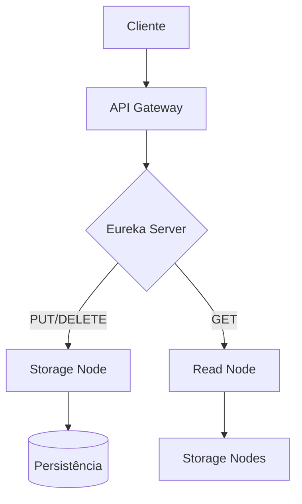
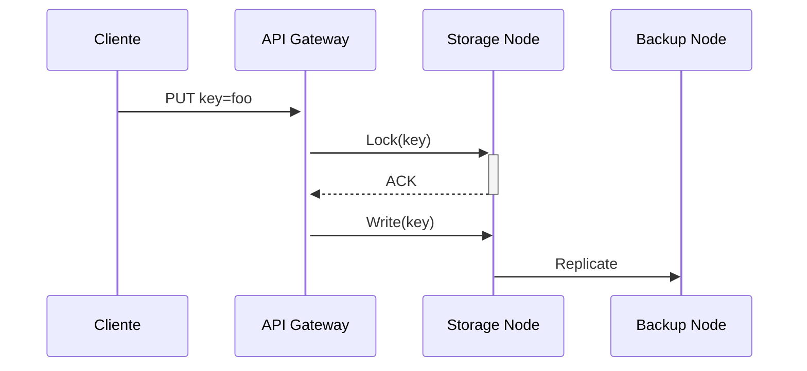
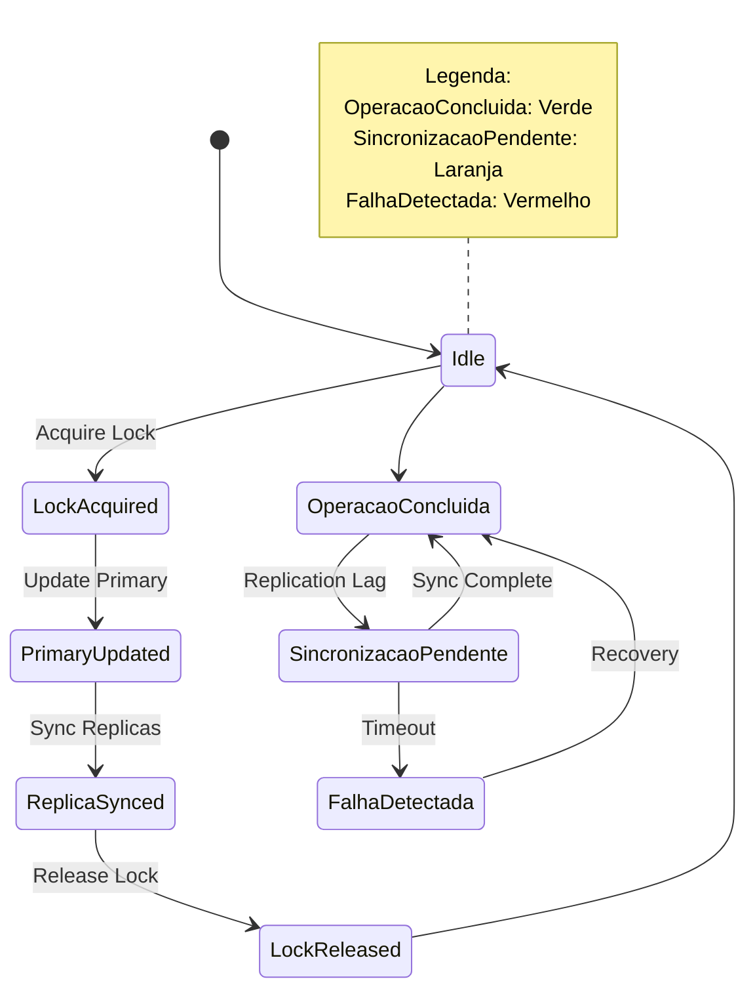

# Key-Value

### 1. Introdução
Esse repostório contem um sistema distribuído para armazenamento de pares **key-value**. Baseado em microserviços containerizados com Docker, o mesmo oferece:
- Portabilidade
- Escalabilidade automática
- Consistência de dados

### 2. Arquitetura do Sistema
#### 2.1 Componentes Principais

| Componente          | Função                                                               |
|---------------------|----------------------------------------------------------------------|
| **Eureka Server**   | Registro e descoberta de serviços e Health Check                     |
| **API Gateway**     | Ponto único de entrada para API REST                                 |
| **Storage Nodes**   | Armazenamento persistente (3 instâncias padrão)                      |
| **Read Node**       | Balanceamento de consultas                                           |
| **Backup Node**     | Replicação para recuperação de falhas                                |

#### 2.2 Fluxo de Requisições


## 3. Operações da API

### 3.1 PUT - Inserir/Atualizar
```bash
curl -X PUT http://localhost:8080/key-value \
  -H "Content-Type: application/json" \
  -d '{"data":{"key":"exemplo","value":"teste"}}'
```

```markdown
### 3.2 GET - Consultar
```bash
curl -X GET "http://localhost:8080/key-value?key=exemplo"
```

**Resposta:**
```json
{
  "data": {
    "value": "teste"
  }
}
```

### 3.3 DELETE - Remover
```bash
curl -X DELETE "http://localhost:8080/key-value?key=exemplo"
```

## 4. Instalação

### 4.1 Pré-requisitos
- Docker 20.10+
- Docker Compose 2.6+
- 4GB RAM disponível

### 4.2 Inicialização
```bash
git clone https://github.com/a90985/key-value
cd key-value-store
chmod +x start.sh
./start.sh
```

## 5. Especificações Técnicas

### 5.1 Performance
| Métrica               | Valor        |
|-----------------------|-------------|
| Latência (média)      | 50ms        |
| Throughput máximo     | 500 req/s   |
| Tempo de failover     | < 15s       |

### 5.2 Limitações
- Armazenamento máximo por nó: 10GB
- Tamanho máximo por valor: 1MB
- Suporte apenas para strings

## 6. Monitoramento
Acesse os dashboards:
- [Swagger UI](http://localhost:8080/swagger-ui.html)
- [Health Checks](http://localhost:8081/actuator/health)
- [Métricas](http://localhost:8081/actuator/metrics)

## 7. Aspectos de Sistemas Distribuídos

### 7.1 Concorrência
🔄 O sistema suporta múltiplas requisições simultâneas através de:
- API Gateway como gerenciador central de pedidos
- Locks para escrita
- Mecanismos de sincronização entre nós

**Fluxo de Operações Concorrentes:**


### 7.2 Escalabilidade
📈 Arquitetura escalável com:
- Auto-scaling horizontal de Storage/Read Nodes
- Registro no Eureka Server
- Balanceamento automático de carga

**Cenário de Escala:**
```bash
# Comando para adicionar novo nó
docker-compose scale storage-node=4
```

### 7.3 Tolerância a Falhas
🛡️ Mecanismos de resiliência:
- Replicação síncrona para Backup Node
- Retry policy para operações falhas

### 7.4 Consistência
⚖️ Modelo híbrido com:
- Consistência eventual para GETs
- Consistência forte para PUTs/DELETEs

### 7.5 Coordenação de Recursos
🤝 Protocolos implementados:
1. Heartbeat com Eureka
2. Lock distribuído

### Diagrama de Consistência

> ⚠️ Esta seção foi planejada para ilustrar visualmente o fluxo de consistência no sistema. No entanto, devido à limitação de tempo durante o desenvolvimento do projeto, o diagrama não pôde ser implementado em sua totalidade.



## 7. Tecnologias e Ferramentas Utilizadas

| Categoria                    | Ferramenta/Plataforma        | Finalidade                                                      |
| ---------------------------- | ---------------------------- | --------------------------------------------------------------- |
| Linguagem de Programação     | Java 17                      | Desenvolvimento dos microserviços                               |
| Framework                    | Spring Boot                  | Criação de APIs REST e serviços independentes                   |
| Registro de Serviços         | Eureka (Netflix OSS)         | Descoberta e monitoramento de serviços ativos                   |
| Orquestração de Containers   | Docker, Docker Compose       | Empacotamento, isolamento e execução de cada componente         |
| Roteamento                   | Spring Cloud Gateway         | API Gateway que direciona requisições aos serviços corretos     |
| Persistência                 | H2 Database (modo file)      | Armazenamento leve e local dos pares key-value                  |
| Balanceamento de Leitura     | Serviço dedicado (Read Node) | Distribuição eficiente de consultas GET entre os nós            |
| Backup e Tolerância a Falhas | Backup Node                  | Replicação dos dados e recuperação em caso de falha             |
| Monitoramento e Saúde        | Spring Boot Actuator         | Exposição de métricas e verificação de integridade dos serviços |
| Scripts                      | Bash (`start.sh`)            | Inicialização automatizada de todo o ambiente                   |
| Controle de Versão           | Git + GitHub                 | Versionamento e hospedagem do código-fonte                      |

